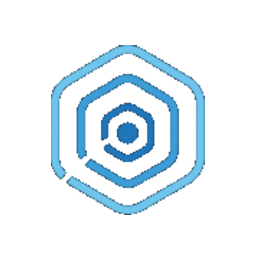

# ErgenOS Welcome

<p align="center">
  
</p>

[](https://github.com/ErgenosSW/ErgenOS-Welcome/releases)
[](LICENSE)

ErgenOS Welcome is the welcome application included with [ErgenOS](https://github.com/ErgenosSW/ErgenOS-Linux).

It opens the installer in the live environment and provides quick access to ErgenPac, ErgenCTL, the official ErgenOS website and project resources after installation. Automatic startup can be disabled from the application.

## Development

Run from the source tree:

```bash
PYTHONPATH=src python3 -m ergenos_welcome.app
```

Run the test suite:

```bash
PYTHONPATH=src python3 -m unittest discover -s tests -v
```

Build with Meson:

```bash
meson setup build
meson compile -C build
```

## License

ErgenOS Welcome is available under the [GPL-3.0-or-later](LICENSE) license.
